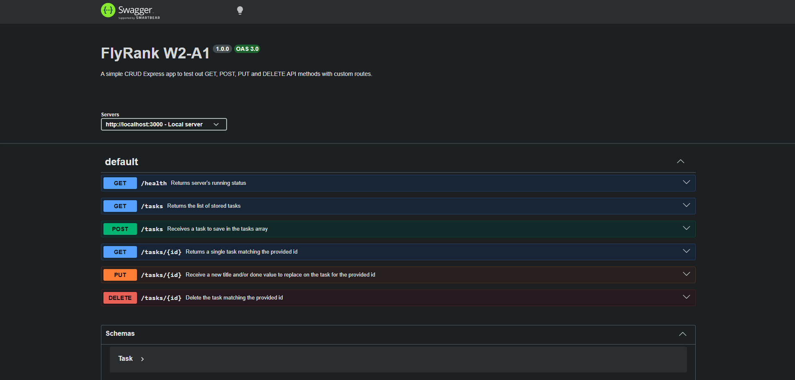
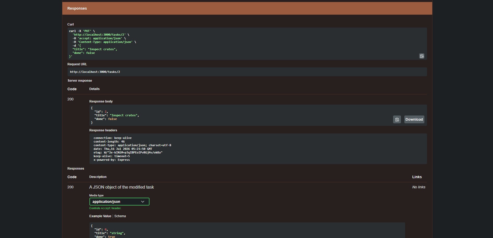

# FlyRank W2 A1
A simple CRUD application built with Express. It consists of GET, POST, PUT and DELETE API methods with custom routes.

## Features
- Stores task information in a tasks list
- Reads all tasks from the list
- Reads a single task for the provided Id
- Updates task information for a provided Id
- Deletes task matching the provided Id

## Tech Stack
- JavaScript, Express.js, SwaggerUI

## Prerequisites
- Node.js (v18 or higher)
- npm


## Installation
```
git clone https://github.com/sonuoso/flyrank-w2-a1
cd flyrank-w2-a1
npm install
```

## Usage/Running the App
```
npm start
```
- This starts the Express and will show *Server is running on port 3000.* when running successfully.

## API Reference
| **Method** | **Path** | **Description** |
| :--- | :--- | :--- |
| GET | /health | Checks if the status of the server. Running successfully - `{ "status": "ok" }` |
| GET | /tasks | Shows all the saved tasks. Response - an array of task objects. `[{ "id": number, "title": "string", "done": boolean }]` |
| GET | /tasks/:id | Shows all the information of the task for the given id in the path. Required - `id`. Returns a task object |
| POST | /tasks | Saves a task in the tasks with the given title in the request body and retuns newly created task object. Request - `{ "title": "string" }`, Response - `{ "id": number, "title": "string", "done": boolean }` |
| PUT | /tasks/:id | Updates the title and/or done status of the task matching the id in the request body with values in the request body and returns the updated task object. Request - `{ "title": "string", "done": boolean }`, Response - `{ "id": number, "title": "string", "done": boolean }` |
| DELETE | /tasks/:id | Delete the task from tasks matching the given id in the path. Required - `id` |

## Example Request
**POST /tasks**
```bash
curl -i -X POST http://localhost:3000/tasks -H "Content-Type: application/json" -d '{"title": "Inspect produce crates"}'
```

**Response** - *Example: id is 4*
```
HTTP/1.1 201 Created
X-Powered-By: Express
Content-Type: application/json; charset=utf-8
Content-Length: 54
ETag: W/"36-IVDKh8YjIHGhj93enrQ5Iva7eSg"
Date: Thu, 16 Jul 2026 07:37:37 GMT
Connection: keep-alive
Keep-Alive: timeout=5

{"id":4,"title":"Inspect produce crates","done":false}
```

## API Documentation (Swagger)
Once the server is running, visit `http://localhost:3000/docs`. It will show all the API route along with the option to test routes and inspect responses visually.





## The Mortality Experiment
A new task with `{ title: "Check produce crates" }` created using `POST` returned the new task with the automatically assigned `id = 4` but when the server restarted and called `GET` on all tasks, it only had 3 tasks with the maximum id value being 3. Since tasks are saved to an in-memory array on the running server and upon restart, tasks array is reverted to its default values discarding changes.